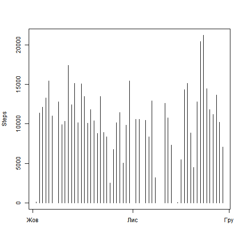
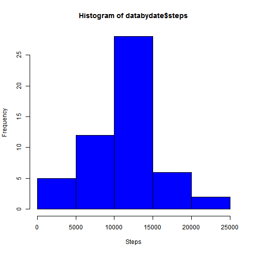
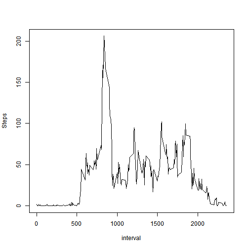
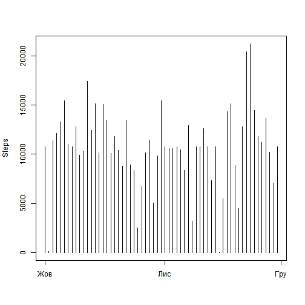
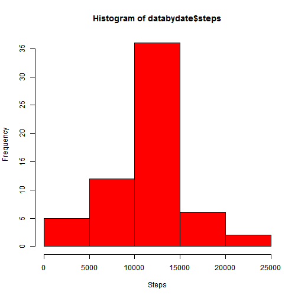
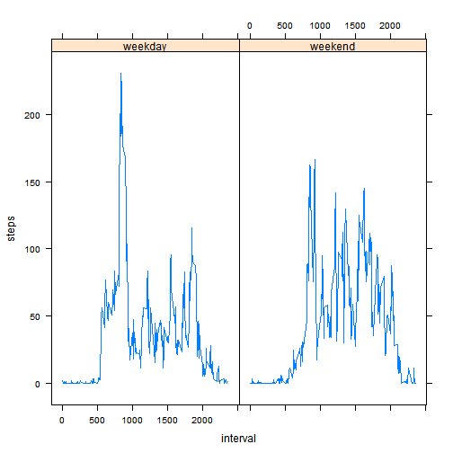

# Reproducible Research: Peer Assessment 1


## Loading and preprocessing the data

First we load our data to the dataframe

```r
data <- read.csv("activity.csv", header = TRUE, stringsAsFactors = FALSE)
head(data)
```

```
##   steps       date interval
## 1    NA 2012-10-01        0
## 2    NA 2012-10-01        5
## 3    NA 2012-10-01       10
## 4    NA 2012-10-01       15
## 5    NA 2012-10-01       20
## 6    NA 2012-10-01       25
```


## What is mean total number of steps taken per day
Plot a number of steps for each day

```r
databydate <- aggregate(steps ~ date, data, sum)
plot(strptime(databydate$date, format = "%Y-%m-%d"), databydate$steps, type = "h", 
    xlab = "", ylab = "Steps")
```

 

And a histogram for it

```r
hist(databydate$steps, col = "blue", xlab = "Steps")
```

 

And calculate mean and median for steps per day


```r
daymean <- mean(databydate$steps)
daymedian <- median(databydate$steps)
```

So mean is 1.0766 &times; 10<sup>4</sup> and median is 10765


## What is the average daily activity pattern?
Plot daily activity pattern

```r
databyinterval <- aggregate(steps ~ interval, data, mean)
plot(databyinterval$interval, databyinterval$steps, type = "l", xlab = "interval", 
    ylab = "Steps")
```

 

We can see that max steps contains interval 835

## Imputing missing values
1. Report total NA in dataset

```r
sum(is.na(data))
```

```
## [1] 2304
```


2. Replace NA's with mean steps for given interval


```r
newdata <- data
newdata[is.na(newdata), 1] <- databyinterval$steps[match(newdata$interval[is.na(newdata)], 
    databyinterval$interval)]
```

 After that remade our plots from first exercise

```r
databydate <- aggregate(steps ~ date, newdata, sum)
plot(strptime(databydate$date, format = "%Y-%m-%d"), databydate$steps, type = "h", 
    xlab = "", ylab = "Steps")
```

 

And a histogram for it

```r
hist(databydate$steps, col = "red", xlab = "Steps")
```

 

And calculate mean and median for steps per day


```r
daymean <- mean(databydate$steps)
daymedian <- median(databydate$steps)
```

So mean is 1.0766 &times; 10<sup>4</sup> and median is 1.0766 &times; 10<sup>4</sup>
As we can see mean and mediannow the same, and mean hasn't change
 

## Are there differences in activity patterns between weekdays and weekends?
Create factor first (I'm use ukrainian locale, so day of weeks may appear strange)

```r
newdata$day <- factor(ifelse(as.POSIXlt(strptime(newdata$date, format = "%Y-%m-%d"))$wday == 
    0 | as.POSIXlt(strptime(newdata$date, format = "%Y-%m-%d"))$wday == 6, "weekend", 
    "weekday"))
```


Next plot 

```r
databyinterval <- aggregate(steps ~ interval * day, newdata, mean)
library(lattice)
xyplot(steps ~ interval | day, databyinterval, type = "l")
```

 

